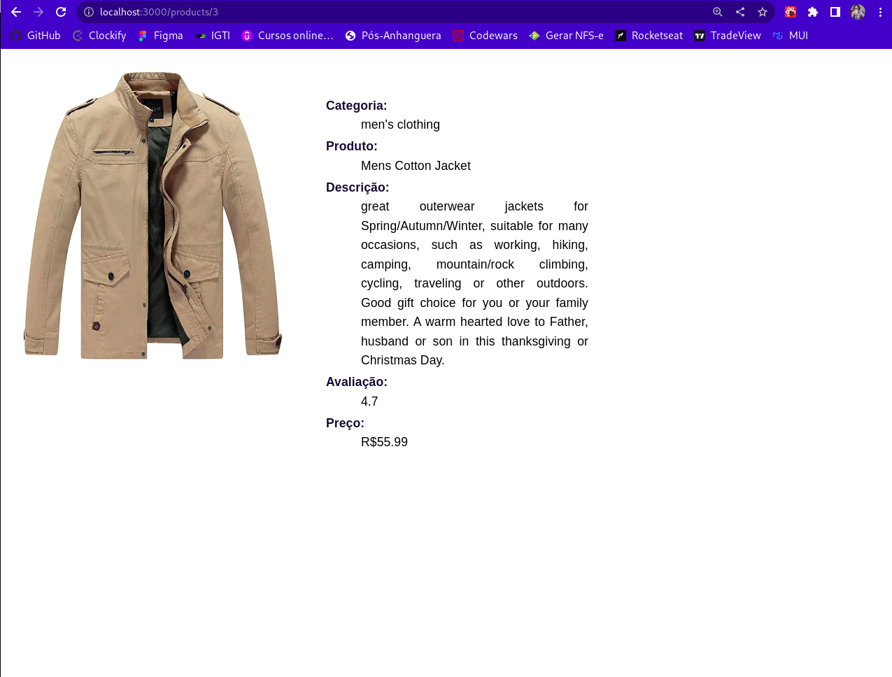

# storewithNEXT
Projeto realizado durante o curso de Pós-Graduação em Desenvolvimento FullStack do IGTI/XP Educação
Tela inicial, carregada utilizando a estratégica ISR (Incremental Static Regeneration), na qual são apresentados os dez produtos melhor avaliados do site.

Ao clicar no nome do produto, são apresentados seus detalhes. Para tanto é utilizado o hook useRouter do NEXT e o data fetching é realizado usando a estratégica SWR (Stale While Revalidate)

